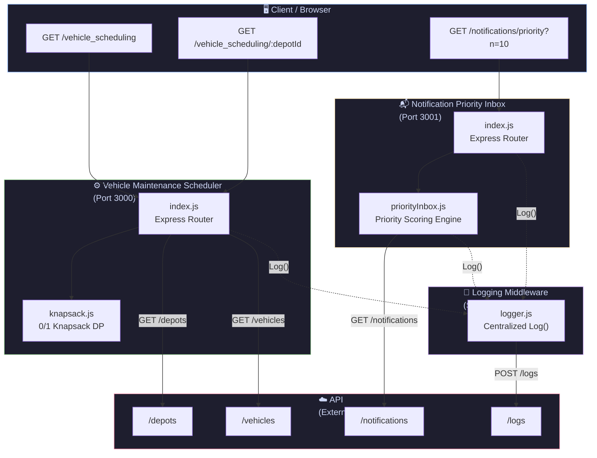
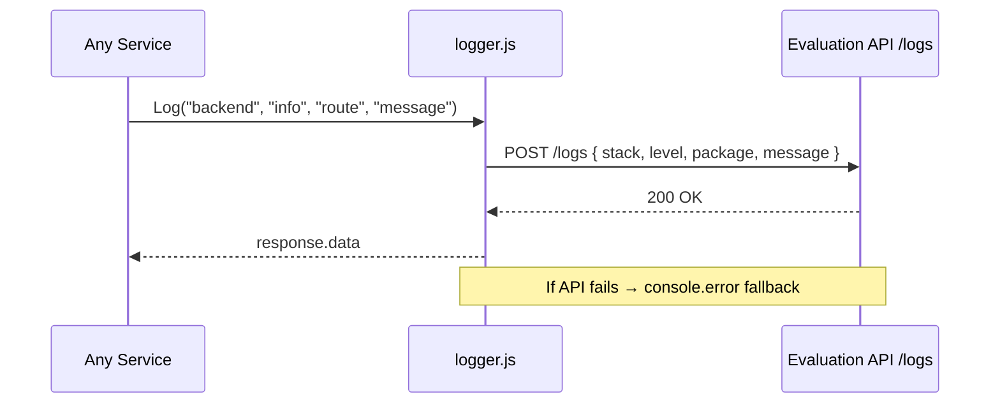
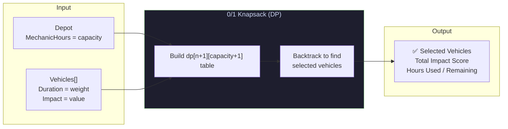
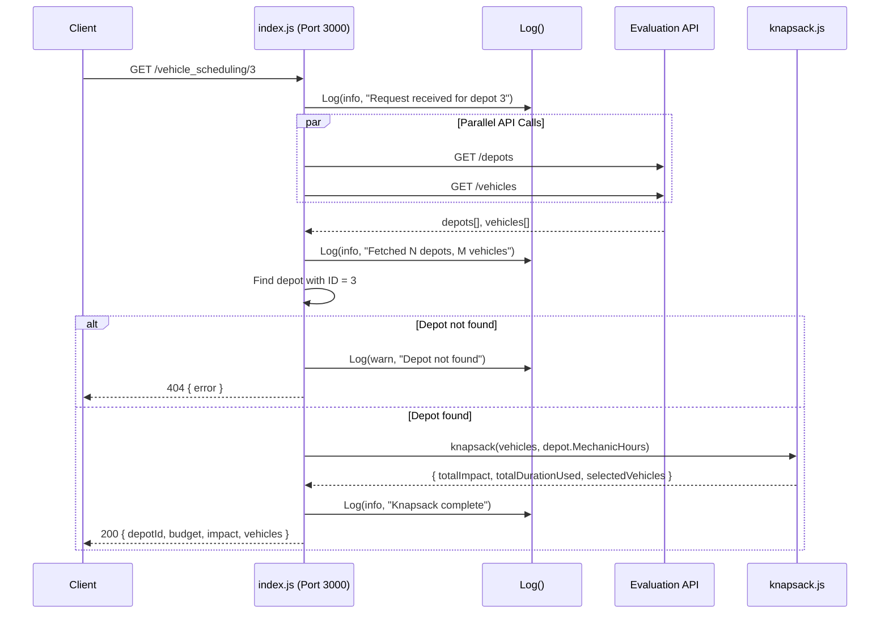
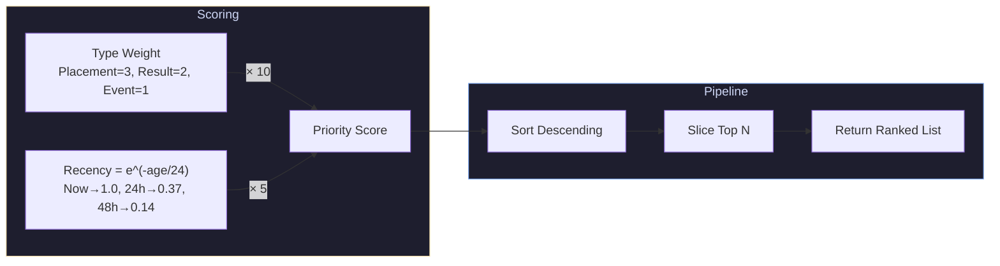
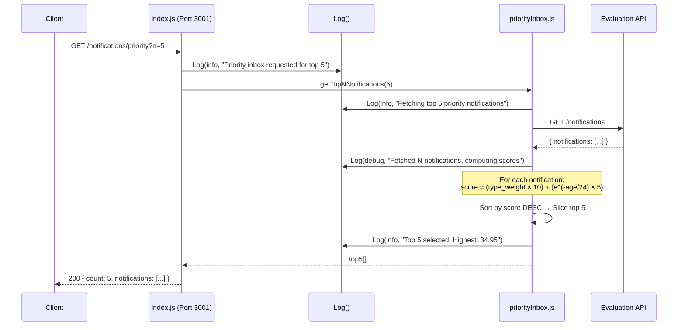
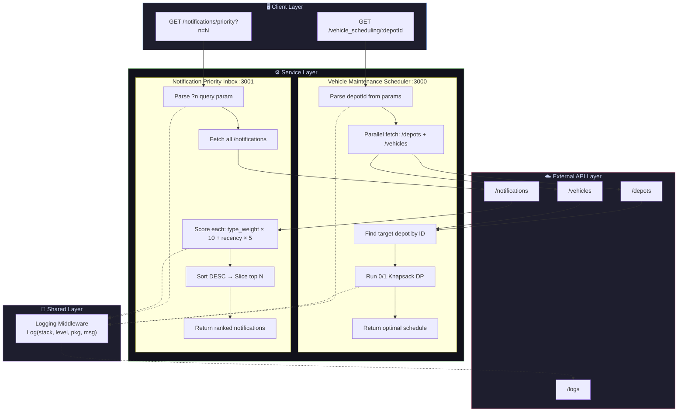
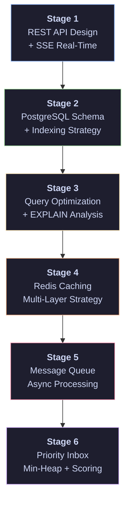

A modular, microservice-style backend system built with **Node.js** and **Express**, consisting of three integrated services: a centralized **Logging Middleware**, a **Vehicle Maintenance Scheduler** (using a 0/1 Knapsack algorithm), and a **Notification Priority Inbox** (using exponential-decay scoring). All services communicate with the **Afford Medical Evaluation API** for data and log persistence.

---

## 📑 Table of Contents

- [High-Level Architecture](#-high-level-architecture)
- [Project Structure](#-project-structure)
- [Module Deep Dives](#-module-deep-dives)
  - [1. Logging Middleware](#1-logging-middleware)
  - [2. Vehicle Maintenance Scheduler](#2-vehicle-maintenance-scheduler)
  - [3. Notification Priority Inbox](#3-notification-priority-inbox)
- [End-to-End Data Flow](#-end-to-end-data-flow)
- [Notification System Design (Stages 1–6)](#-notification-system-design-stages-16)
- [Tech Stack](#-tech-stack)
- [Getting Started](#-getting-started)
- [API Reference](#-api-reference)
---

## 🏗 High-Level Architecture



---

## 📁 Project Structure

```
RA2311028010024/
├── .env                              # Shared environment variables (token, API URL)
├── .gitignore
├── README.md                         # ← You are here
├── notification_system_design.md     # Detailed 6-stage system design document
│
├── logging_middleware/               # 📝 Shared logging service
│   ├── logger.js                     #    Core Log() function → POST /logs
│   ├── test.js                       #    Smoke test for logger
│   ├── .env                          #    API credentials
│   └── package.json
│
├── notification_app_be/              # 📬 Notification Priority Inbox backend
│   ├── index.js                      #    Express server (port 3001)
│   ├── priorityInbox.js              #    Scoring engine (type weight + recency)
│   ├── .env                          #    API credentials
│   └── package.json
│
└── vehicle_maintenance_scheduler/    # ⚙️  Vehicle Scheduling backend
    ├── index.js                      #    Express server (port 3000)
    ├── knapsack.js                   #    0/1 Knapsack dynamic programming
    ├── .env                          #    API credentials
    └── package.json
```

---

## 🔬 Module Deep Dives

### 1. Logging Middleware

> **Purpose:** A shared utility module that provides a single `Log()` function used by all services to send structured logs to the external evaluation API.



**How It Works:**
| Parameter | Type | Allowed Values |
|-----------|------|----------------|
| `stack` | `string` | `"backend"`, `"frontend"` |
| `level` | `string` | `"debug"`, `"info"`, `"warn"`, `"error"`, `"fatal"` |
| `package` | `string` | `"cache"`, `"controller"`, `"db"`, `"domain"`, `"handler"`, `"repository"`, `"route"`, `"service"`, `"auth"`, `"config"`, `"middleware"`, `"utils"` |
| `message` | `string` | Any descriptive message |

- Uses **Bearer token authentication** to call the evaluation API
- Gracefully falls back to `console.error` if the API is unreachable
- Imported by both the Vehicle Scheduler and the Notification Backend

---

### 2. Vehicle Maintenance Scheduler

> **Purpose:** Given a depot's limited mechanic hours, determine the **optimal subset of vehicles** to service that maximizes total maintenance impact — a classic **0/1 Knapsack problem** solved via dynamic programming.



**Algorithm Walkthrough:**

```
For each vehicle i (1 to n):
  For each capacity w (0 to MechanicHours):
    Option A: Skip vehicle i  →  dp[i][w] = dp[i-1][w]
    Option B: Take vehicle i  →  dp[i][w] = dp[i-1][w - Duration] + Impact
    
    dp[i][w] = max(Option A, Option B)

Backtrack from dp[n][capacity] to identify which vehicles were selected.
```

**Complexity:**
| Metric | Value |
|--------|-------|
| Time | `O(n × capacity)` |
| Space | `O(n × capacity)` |
| Backtracking | `O(n)` |

**End-to-End Flow:**



---

### 3. Notification Priority Inbox

> **Purpose:** Fetch all notifications from the evaluation API and rank them by priority using a **weighted scoring formula** that considers both the notification **type** and its **recency**.

**Priority Scoring Formula:**

```
score = (type_weight × 10) + (recency_score × 5)
```

| Notification Type | Type Weight | Rationale |
|-------------------|-------------|-----------|
| 🏢 **Placement** | 3 | Time-sensitive, career-critical |
| 📊 **Result** | 2 | Important but not urgent |
| 📅 **Event** | 1 | Informational |

**Recency Score** uses exponential decay:

```
recency_score = e^(−age_in_hours / 24)
```



**Score Examples:**

| Notification | Type Weight | Age | Recency | **Final Score** |
|---|---|---|---|---|
| Placement (just now) | 3 | 0h | 1.00 | **35.00** |
| Result (2h ago) | 2 | 2h | 0.92 | **24.60** |
| Placement (48h ago) | 3 | 48h | 0.14 | **30.68** |
| Event (just now) | 1 | 0h | 1.00 | **15.00** |

**End-to-End Flow:**



---

## 🔄 End-to-End Data Flow

This diagram shows how **all three modules interact** end-to-end in a complete request lifecycle:



---

## 📐 Notification System Design (Stages 1–6)

The project includes a comprehensive **6-stage system design** for a university-scale notification system. Below is a summary — see [`notification_system_design.md`](notification_system_design.md) for full details.



| Stage | Topic | Key Decisions |
|-------|-------|---------------|
| **1** | REST API + Real-Time | 5 endpoints + SSE for push notifications |
| **2** | Database Schema | PostgreSQL with UUID PKs, ENUMs, partial indexes |
| **3** | Query Optimization | Composite partial index, eliminate `SELECT *`, covering indexes |
| **4** | Caching Strategy | Redis multi-layer: unread count (30s TTL) + page cache (60s TTL) |
| **5** | Async Processing | Message queue with bulk DB insert → async email/push workers + DLQ |
| **6** | Priority Inbox | Weighted scoring formula + Min-Heap for O(log N) top-N maintenance |

---

## 🛠 Tech Stack

| Layer | Technology | Purpose |
|-------|-----------|---------|
| **Runtime** | Node.js | Server-side JavaScript execution |
| **Framework** | Express.js v5 | HTTP routing and middleware |
| **HTTP Client** | Axios | External API communication |
| **Config** | dotenv | Environment variable management |
| **Algorithm** | Custom DP | 0/1 Knapsack (no external libs) |
| **Scoring** | Custom Math | Exponential decay priority scoring |
| **External API** | Afford Medical Evaluation API | Data source + log persistence |

---

## 🚀 Getting Started

### Prerequisites

- **Node.js** ≥ 18.x
- **npm** ≥ 9.x
- Valid **ACCESS_TOKEN** from Afford Medical Technologies

### Installation

```bash
# 1. Clone the repository
git clone <repo-url>
cd RA2311028010024

# 2. Install dependencies for each service
cd logging_middleware && npm install && cd ..
cd vehicle_maintenance_scheduler && npm install && cd ..
cd notification_app_be && npm install && cd ..
```

### Running the Services

```bash
# Terminal 1 — Vehicle Maintenance Scheduler (port 3000)
cd vehicle_maintenance_scheduler
node index.js

# Terminal 2 — Notification Priority Inbox (port 3001)
cd notification_app_be
node index.js
```

### Testing

```bash
# Test the logging middleware
cd logging_middleware
node test.js

# Test Vehicle Scheduler — Single depot
curl http://localhost:3000/vehicle_scheduling/1

# Test Vehicle Scheduler — All depots
curl http://localhost:3000/vehicle_scheduling

# Test Notification Priority Inbox — Top 5
curl "http://localhost:3001/notifications/priority?n=5"
```

---

## 📚 API Reference

### Vehicle Maintenance Scheduler (Port 3000)

#### `GET /vehicle_scheduling/:depotId`

Get the optimal maintenance schedule for a specific depot.

**Response:**
```json
{
  "depotId": 1,
  "mechanicHoursBudget": 120,
  "totalImpactScore": 285,
  "hoursUsed": 118,
  "hoursRemaining": 2,
  "vehiclesSelected": 5,
  "selectedVehicles": [
    { "TaskID": 12, "Duration": 24, "Impact": 85 }
  ]
}
```

#### `GET /vehicle_scheduling`

Get optimal schedules for **all** depots.

**Response:**
```json
{
  "schedules": [
    {
      "depotId": 1,
      "mechanicHoursBudget": 120,
      "totalImpactScore": 285,
      "hoursUsed": 118,
      "selectedVehicles": [...]
    }
  ]
}
```

---

### Notification Priority Inbox (Port 3001)

#### `GET /notifications/priority?n={count}`

Get the top N highest-priority notifications, ranked by type importance and recency.

| Query Param | Type | Default | Description |
|-------------|------|---------|-------------|
| `n` | `integer` | `10` | Number of top notifications to return |

**Response:**
```json
{
  "count": 5,
  "notifications": [
    {
      "Type": "Placement",
      "Message": "Google hiring drive tomorrow",
      "Timestamp": "2026-05-02T10:00:00Z",
      "priorityScore": 34.95
    }
  ]
}
```


